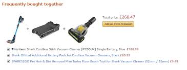

```{r setup, include=FALSE}
knitr::opts_chunk$set(echo = TRUE, fig.align = 'center')
```

<hr>

# MVP

## Hypothesis testing - practical

You work for an animal conservation organisation and are looking to do some investigating into some of the animals to provide evidence for some projects you are looking to run. 

In this homework we'll use the `msleep` data set provided in the `ggplot` package. It concerns the sleeping patterns of various types of mammal.

```{r, message = FALSE, warning=FALSE}
library(tidyverse)
data(msleep)
library(infer)
```

<br>

**Question 1.**  
Explore the dataset and familiarise yourself with it.
```{r}
glimpse(msleep)
```


<br>

**Question 2.**  
Jabberwockies sleep for around 7 hours a night, on average. Perform an appropriate statistical test to determine whether the mean `sleep_total` in the sampled population of animal types differs from the typical value for jabberwockies.
```{r}
msleep %>% 
  ggplot(aes(sleep_total)) +
  geom_histogram(col = "white", bins = 30)
```
```{r}
obs_stat <- mean(msleep$sleep_total, na.rm = T)
obs_stat
# Looks like the sample mean is higher that the typical value of 7 for jabberwockies.
```
Our hypotheses: $H_0:\mu(sleep\_total) = 7$ and $H_a:\mu(total\_sleep) \not= 7$


```{r}
null_distribution <- msleep %>% 
  specify(response = sleep_total) %>% 
  hypothesise(null = "point", mu = 7) %>% 
  generate(reps = 10000, type = "bootstrap") %>% 
  calculate(stat = "mean")
```
<br>
Let us plot this

```{r}
null_distribution %>% 
  visualise() +
  shade_pvalue(obs_stat = obs_stat, direction =  "both")
```
```{r}
p_value <- null_distribution %>% 
  get_pvalue(obs_stat = obs_stat, direction = "both")

p_value
```
Given this analysis, we reject $H_0$ and conclude that the mean `sleep_total` in the population of animal types significantly differs from the typical value of 7 for jabberwockies.

<hr>

**Question 3.**  
Perform an appropriate statistical test to determine whether omnivores sleep for significantly longer than herbivores, on average.

```{r}
obs_stat <- msleep %>% 
  filter(vore %in% c("omni", "herbi")) %>%
  specify(sleep_total ~ vore) %>% 
  calculate(stat = "diff in means", order = c("omni", "herbi")) # Looks like omnivores sleep 1.4 hours more on average in our sample.
```


Our hypotheses: $H_0:\mu(diff\_sleep) = 0$ and $H_a:\mu(diff\_sleep) \not= 0$
<br>

```{r}
null_distribution <- msleep %>% 
  filter(vore %in% c("omni", "herbi")) %>%
  specify(sleep_total ~ vore) %>% 
  hypothesise(null = "independence") %>% 
  generate(reps = 10000, type = "permute") %>% 
  calculate(stat = "diff in means", order = c("omni", "herbi"))
```
<br>

```{r}
null_distribution %>% 
  visualise() +
  shade_pvalue(obs_stat = obs_stat, direction =  "both")
```

```{r}
p_value <- null_distribution %>% 
  get_pvalue(obs_stat = obs_stat, direction = "both")

p_value
```

As the p-value is high (i.e. above the standard convention $\alpha = 0.05$) we fail to reject $H_0$; the difference in total sleeping hours between omnivores and carnivores is not statistically significant.

<hr>

**Question 4. **
Perform an appropriate statistical test to determine whether the proportion of domesticated animal types in the population of animal types is greater than $5\%$.
<br>
<details>
<summary>**Hint**</summary>
Think about creating an `is_domesticated` variable for the analysis
</details>
<br>

Our hypotheses: $H_0:\pi(diff\_sleep) \le 0.05$ and $H_a:\mu(diff\_sleep) > 0.05$
<br>

```{r}
obs_stat <- nrow(filter(msleep, conservation == "domesticated")) / nrow(msleep)
```

```{r}
msleep_dom <- msleep %>% 
  mutate(domesticated_flag = case_when(
    conservation == "domesticated" ~ "t",
    TRUE ~ "f")) # The assumption here is that none of the NA values correspond to domesticated species
```

```{r}
null_distribution <- msleep_dom %>% 
  specify(response = domesticated_flag, success = "t") %>% 
  hypothesise(null = "point", p = 0.05) %>% 
  generate(reps = 10000, type = "draw") %>% 
  calculate(stat = "prop")
```

```{r}
null_distribution %>% 
  visualise(bins = 14) +
   shade_pvalue(obs_stat = obs_stat,
                direction = "right")
```

```{r}
p_value <- null_distribution %>% 
  get_pvalue(obs_stat = obs_stat, direction = "right")

p_value
```
In this case the p-value is lower than the conventional standard $\alpha = 0.05$. If instead of taking NAs as not domesticated we drop them from the analysis, e.g. with `if_else(conservation == "domesticated", "t", "f"))`, this value would be higher (~ 0.02) but still lower than $\alpha$. So we can safely reject $H_0$ and conclude that the proportion of domesticated animals is greater than $5\%$.


<hr>

## Hypothesis testing - Defining the Hypothesis 

For the following three business problems write out:

* What kind of test you would use  
*  $H_0$ and $H_a$ in **both** mathematical notation and in words. 
* Also state the method you would use to generate the null distribution (bootstrap, permutation or simulation). 

<br>

**Question 1.**  
You work for a independent coffee shop. The boss tells you that she thinks that around $40\%$ of people in the town (population $30,000$) know of the coffee shop, but you are skeptical of the estimate. You conduct a random survey of $200$ people in the town, asking if respondents are aware of your coffee shop. You want to use the sample to test the hypothesis that $40\%$ or more of the town's population have heard of the coffee shop.
<br><br>

This is a one sample proportion test that would use simulation ('draw') to generate the null distribution. $H_0$ would be that fewer people than 40% know of the coffee shop, i.e. our hypotheses: $H_0:\pi(know\_shop) < 0.4$ and $H_a:\mu(know\_shop) \ge 0.4$

<br><br>
**Question 2.**  
You work for a website design company and have performed an **A/B test** on the position of a banner on a website promoting a particular item. 
<br><br>
<div class='emphasis'>
**A/B testing** 
A method comparing two versions of a web page, email, flyer or other marketing device against each other to determine which version performs better. As it is essentially a controlled experiment, the design should try to ensure that the groups experiencing both versions of the marketing device are equivalent and representative of the population.
</div>
<br><br>
You selected five days at random last month and then randomly selected $200$ of each sampled day's users into group $A$ and another $200$ of that day's users into group $B$. Group $A$ continued to be shown the banner at the right hand side of the webpage (its usual position) while group $B$ was shown the banner at the top of the page. You monitored each sampled user's interactions with the website, in particular the 'click through rate' (CTR) on the banner, i.e. what proportion of sampled users clicked on the banner. You want to use the sampled data to test the hypothesis that website users overall are more likely to click on the banner if positioned at the top of the page. 
<br><br>

This is a two independent sample difference in proportions test that would use permutation to generate the null distribution. $H_0$ would be that the proportion of users who click on the top banner is the same or smaller than the proportion of users who click on the right banner, i.e. our hypotheses: $H_0:\pi(top\_CTR) \le \pi(right\_CTR)$ (this is the same as $H_0:\pi(top\_CTR) - \pi(right\_CTR) \le 0$) and $H_a:\pi(top\_CTR) > \pi(right\_CTR)$

<br><br>
**Question 3.**  
You work as an analyst for a car manufacturing company - they have specific standards they must meet for standards and regulation purposes. You have been asked to check the quality control of the manufacture of a particular car part. You have been given data on a sample of $200$ parts produced over the period of a week (the sampled parts were pulled at random from the production line and measured: the factory produced a lot more than $200$ parts that week). The specification of the part stipulates a width of $145\textrm{mm}$, and the manufacturing process is said to have 'drifted' if the mean width of parts differs significantly from $145\textrm{mm}$. You want to use the sampled measurements to test whether the process overall has drifted.     
<br>

This is a one sample difference in means test that would use bootstrapping to generate the null distribution. $H_0$ would be that the process hasn't drifted, i.e. our hypotheses: $H_0:\mu(diff\_width) = 0$ and $H_a:\mu(diff\_width) \not= 0$.

<br><br><br>
## Hypothesis Testing - Interpreting the results

For the 3 business problems stated above, imagine we performed you got the following p-values (with the given significance levels) write out your interpretation of the results. 

<br>

**Question 1.**  

**Coffee shop problem**. Significance level: 0.05, calculated $p$-value: 0.07. As $p > \alpha$ we fail to reject $H_0$, i.e. we cannot rule out that fewer than 40% people know of the coffee shop.

<br>

**Question 2.**  

**Website company problem**. Significance level: 0.01, $p$-value: 0.006. As $p < \alpha$ we reject $H_0$, i.e. it is statistically likely that a top banner would get more clicks than the right banner.

<br>

**Question 3.**  

**Manufacturing company problem**. Significance level: 0.05, $p$-value: 0.55. As $p > \alpha$ we fail reject $H_0$, i.e. we cannot say that the process has drifted, our test supports that piece quality hasn't changed significantly.


# Extension

## Market Basket Analysis

**Association rule mining** is regularly used by retailers to find associations between products that people purchase, perhaps for an online retailer, the items that people put together in their 'baskets', and in a bricks and mortar retailer, the items purchased together in a single transaction. The aim is to find recurring patterns in the transactions which the retailer can then use to do targeted marketing of items, seeking to increase 'cross sales'. Rules mining of this sort can also be used in other industries beyond retail to identify patterns in data. 

**Market basket analysis (MBA)** uses association rule mining. It looks at the association of items occurring in a **single basket**, and so won't look at your purchases over time, but only items that are purchased together in a single purchase (i.e. a 'basket'). As a good example, you may have seen the 'Frequently Bought Together' section on Amazon (and other sites), which looks at items you've got in your basket and suggests items that other people commonly have in their baskets when they also have these items:

```{r, echo=FALSE,, out.width = '60%', fig.align="center" }

```

MBA differs from recommendation algorithms because the association rules look only at items bought together in a single purchase, they don't use any characteristics of the purchaser to profile them (e.g. 'Based on purchases by people like you, you may also like...') or how their purchases vary over time. The association rules used for MBA use the probability principles we learned on Monday this week. 

## Association rules 

The rules obtained by MBA have three concepts associated with them, as follows:

**Support**  
The probability of items in the rule being purchased together:

e.g. $\textrm{sup}(A \rightarrow B) = P(\textrm{A and B being purchased together}) = \frac{\textrm{number of transactions involving A and B}}{\textrm{total number of transactions}}$

Support also has meaning for single items:

e.g. $\textrm{sup}(A) = P(A) = \frac{\textrm{number of transactions involving A}}{\textrm{total number of transactions}}$

**Confidence**  
The proportion of purchases of $A$ where $B$ has also been purchased:

e.g. $\textrm{conf}(A \rightarrow B) = \frac{\textrm{P(A and B being purchased together)}}{\textrm{P(A being purchased)}}$

**Lift**  
Increase in sales of $A$ when sold with $B$

$\textrm{lift}(A \rightarrow B) = \frac{\textrm{sup}(A \rightarrow B)}{\textrm{sup}(A) \times \textrm{sup}(B)}$

If $\textrm{sup}(A \rightarrow B) = \textrm{sup}(A) \times \textrm{sup}(B)$ then this means $P(A \textrm{ and } B) = P(A) \times P(B)$. We know from the probability lesson earlier in the week that this means the purchase of $A$ and $B$ are independent events. This may help with our interpretation of lift values:

* $\textrm{lift}(A \rightarrow B) \gt 1$ - items $A$ and $B$ are more likely to be bought together 
* $\textrm{lift}(A \rightarrow B) = 1$ - no correlation between items $A$ and $B$ being bought together
* $\textrm{lift}(A \rightarrow B) < 1$ - items $A$ and $B$ are unlikely to be bought together

A and B don't need to be single items, they could be sets of items (itemsets) e.g. A = {TV, DVD player}, B = {TV stand}. 

## Using the rules 

Once we have calculated the rules we can use them to gain insights about items/itemsets. 

For example, if for items $A$ and $B$ the corresponding rule $(A \rightarrow B)$ has a low support but a lift greater than $1$ then we can say that when $A$ is purchased $B$ is often purchased with it (high lift), but such transactions don't happen all that frequently (low support). 

The **apriori algorithm** is often used as a way of selecting 'interesting' rules. It will calculate all the support, confidence and lift values for the item/itemset combinations of your dataset and will return those with support values greater than a pre-defined threshold value set by the user. 

## Homework exercise

Let's load in some transaction data which has details on the items purchased in each transaction (where each transaction is uniquely identified by the `InvoiceNo` variable). 

```{r}
rm(list = ls())
transactions <- read_csv("data/online_retail_subset.csv")
head(transactions, 20)
```

## Association rules 

For the first section we are interested in the purchase of two particular items:

* item $A$ - 'HEART OF WICKER SMALL' (`StockCode` $22469$) 
* item $B$ - 'LARGE CAKE TOWEL PINK SPOTS' (`StockCode` $21110$)

**Question 1.**  
Calculate the support for item $A$ (this will be the support for a single item)

```{r}
# Support rule i.e. the proportion of transactions 
total_trn <- transactions %>% 
  count(InvoiceNo) %>% 
  nrow()

sup_A <- transactions %>%
  summarise(sup_A = sum(StockCode == 22469) / total_trn) %>% 
  pull()

sup_A
```

**Question 2.**  
Calculate the support and confidence for rule $(A \rightarrow B)$.

```{r}
# The number of transactions with at least both items
trn_A_B <- transactions %>% 
  filter(StockCode == 21110 | StockCode == 22469) %>% 
  count(InvoiceNo) %>% 
  filter(n > 1) %>% 
  nrow()

# The proportion of them
sup_A_B <- transactions %>%
  summarise(sup_A_B = trn_A_B / total_trn) %>% 
  pull()
```

```{r}
# Confidence rule
sup_A_B / sup_A
```

**Question 3.**  
Calculate the lift for $(A \rightarrow B)$

<details>
<summary>**Hint**</summary>
You will need to calculate the support for $B$]
</details>

```{r}
sup_B <- transactions %>%
  summarise(sup_B = sum(StockCode == 21110) / n()) %>% 
  pull()
```

```{r}
# Lift rule
sup_A_B / (sup_A * sup_B)
```

Items $A$ and $B$ are very likely to be bought together 

## Apriori algorithm 

Read up on the `arules` and `arulesViz` packages, which make use of the 'apriori' algorithm http://www.salemmarafi.com/code/market-basket-analysis-with-r/comment-page-1/

Use these packages to play around, applying the apriori algorithm to the `transactions` dataset we have. 

To use the `arules` package we need the data to be a special type of 'transactions' object. We do this by reading in the data using `read.transactions()` function from the `arules` package. We have done this for you below (for more information on this type of transactions object see the helpfile `?transactions`):

```{r, message = FALSE, warning = FALSE}
library(arules)
library(arulesViz)
```

```{r}
transactions_reformat <- transactions %>%
  select(InvoiceNo, Description) %>%
  na.omit()

write_csv(transactions_reformat, "transactions_reformat.csv")

apriori_format <- read.transactions("transactions_reformat.csv", format = "single", sep = ",", header = TRUE, cols = c("InvoiceNo", "Description"))

inspect(head(apriori_format))
```

Now you're all set to play around with `arules` and `arulesViz`. 

**Warning about run time/memory usage:** if the minimum support is set too low for the dataset, then the algorithm will try to create an extremely large set of itemsets/rules. This will result in very long run times and the process may eventually run out of memory. You can either start by trying a reasonably high support (for this dataset, we would suggest starting at $1%$ and then systematically lower the support if don't see any results). There is also an argument `maxtime` which can be used to prevent long run times (more information on that in the `apriori` user document [here](https://rdrr.io/cran/arules/man/apriori.html)). 

